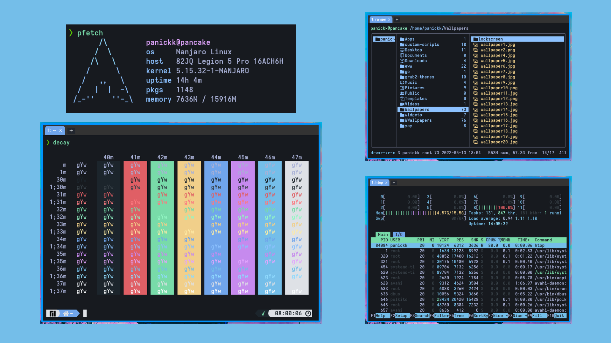

# :diamond_shape_with_a_dot_inside: <samp>Guide</samp>

<h1 align="center">Decay For Terminal Emulators</h1>

# Decay Theme 

## INFORMATION

Decay uses shades of green along with a dark-toned background for better contrast!

The contrast between background and primary color helps avoiding any eye fatigue when spending a lot of time in front of the computer.

## Current Ports :airplane:

| Terminal      | Ported                                                             |
| ------------- | ------------------------------------------------------------------ |
| Alacritty     | [YES](https://github.com/decaycs/decay-terms/tree/main/alacritty)  |
| Kitty         | [YES](https://github.com/decaycs/decay-terms/tree/main/kitty)      |
| Tilix         | [YES](https://github.com/decaycs/decay-terms/tree/main/tilix)      |
| Terminator    | [YES](https://github.com/decaycs/decay-terms/tree/main/terminator) |
| st - Suckless | [YES](https://github.com/decaycs/decay-terms/tree/main/st)         |
| tym           | [YES](https://github.com/decaycs/decay-terms/tree/main/tym)        |
| WezTerm       | [YES](https://github.com/decacs/decay-terms/tree/main/wezterm)     |
| Xresources    | [YES](https://github.com/decaycs/decay-terms/tree/main/xresources) |
| Termux        | [YES](https://github.com/decaycs/decay-terms/tree/main/termux)     |

# :heavy_exclamation_mark: Setup

## IMPORTANT

First clone the repo into your prefered directory using:

`git clone https://github.com/decaycs/decay-terms`

After that, you can get the theme from specific directories for supported terminals.

[See Below](#alacritty)

### [Alacritty](https://github.com/alacritty/alacritty) -

Head over to `alacritty/` and copy `decay.json` to your alacritty config path:

```sh
cd decay-terms/alacritty
cp decay.yml ~/.config/alacritty/alacritty.yml
```

Enable `Decay theme` adding `import: - ~/.config/alacritty/decay.yml` to your `alacritty.yml`

###### Showcase


> Happy ricing :)

## [Kitty](https://github.com/kovidgoyal/kitty) -

Head over to `kitty/` and copy `decay.ini` to your kitty config path:

```sh
cd decay-terms/kitty
cp decay.ini ~/.config/kitty/
```

Enable `Decay theme` adding `include decay.ini` to your `kitty.conf`

###### Showcase


> Happy ricing :)

## [Tilix](https://gnunn1.github.io/tilix-web/) -

Head over to `tilix/` and copy `decay.json` to your tilix schemes directory:

```sh
cd decay-terms/tilix
cp decay.json ~/.config/tilix/schemes
```

To enable `Decay theme` in tilix, you need to follow a few steps:

1. Open your profile preferences (tilix settings)
2. Switch to `Color` tab
3. Select _Decay_ from the color scheme drop-down menu

###### Showcase


> Happy ricing :)

## [Terminator](https://terminator-gtk3.readthedocs.io/en/latest/) -

To get **Decay Theme** for _Terminator_ terminal, you need to dot some I's and cross some T's :|

You need to copy the content of `terminator/decay` into your `~/.config/terminator/config` file under the profiles section.

After you've done that your _Terminator config_ file should look something like this:


To enable `Decay theme` in terminator you need to right click inside terminal and select the `Decay` profile from the drop-down menu.

To make `Decay theme` default, check out [EliverLara Terminator themes](https://github.com/EliverLara/terminator-themes#setting-a-default)

###### Showcase


> Happy ricing :)

## [Suckless - st](https://st.suckless.org/) -

Getting **Decay Theme** for _st_ terminal can be a little bit tricky :|

There are a few approaches to make it work, showing a few for now, but will add extra soon :)

The easiest way is using `xrdb merge` and `path/to/xresources`, in our case you can use:

```
xrdb merge ./st/xresources
```

> This only works using the xresources st patch, for example, we're using the [siduck's st build](https://github.com/siduck/st) that really works nice with this!

Another way is to edit your `~/.Xresources` file to match the colors of **Decay**

To do so, just copy the content of `./st/xresources` into your `~/.Xresources` file, but make sure to edit the correct section, such as _colors section_

> Note\*: If you use **.Xresources** for your rice colors, then your whole rice will change to **Decay Theme** colors. Be Aware !

###### Showcase


> Happy ricing!

## [tym](https://github.com/endaaman/tym) -

To get **Decay Theme** work in _tym_ terminal is quite simple, just head over to `tym/` and copy `theme.lua` to your tym terminal config path:

> By default tym terminal config path is `~/.config/tym`

```sh
cp -r decay-terms/tym/theme.lua ~/.config/tym
```

If you just installed tym and don't have any previous _configurations_ for tym, you can copy the `config.lua`:

```sh
cp -r decay-terms/tym/config.lua ~/.config/tym
```

or if you do have custom _configurations_, then you just add the content of `tym/config.lua` to your `~/.config/tym/config.lua` file.

###### Showcase


> Happy ricing :)

## [WezTerm](https://wezfurlong.org/wezterm/index.html) -

All you need to do is, once again use your favorite keyboard keys, `ctrl+c` and `ctrl+v` :)

Head over to `wezterm/` and copy the content of `wezterm.lua` under the `return section` into your _wezterm_ config file.

###### Showcase



> Happy ricing :)

## [Xresources](https://wiki.archlinux.org/title/x_resources) -

To get the **Decay Theme** in your personal `Xresources` is easy.
Head over the folder `xresources` of the repo, and then copy the file `.Xresources` to your home.

```sh
cd decay-terms/xresources
cp .Xresources ~
```

Now merge the info in your system using `xrdb`:

```sh
xrdb merge ~/.Xresources
```

## [Termux](https://github.com/termux/termux-app) -

All you need to do is just copy theme file to `~/.termux/` then type `termux-reload-settings`.

> Is recommended to put this in your autostart, but not in all cases
